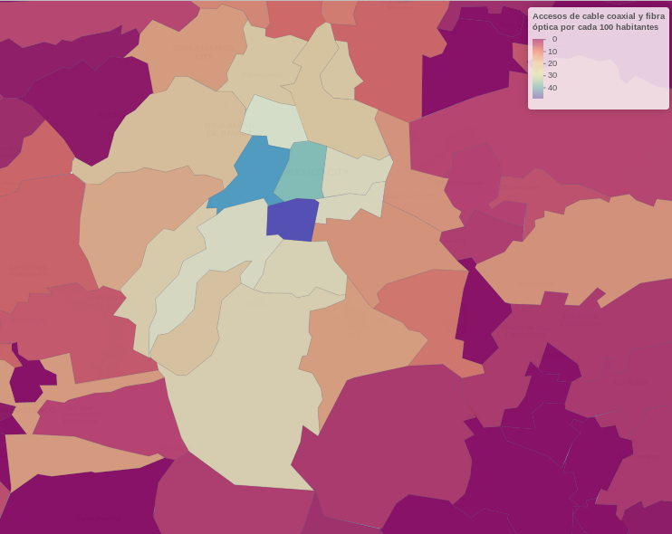

# Métodos de aprendizaje de maquina para inferir el nivel de cobertura de banda ancha fija en municipios  de México

**César Zamora Martínez**

**12 de diciembre de 2019**

Estos son archivos correspondientes al proyecto del curso de Aprendizaje de Máquina de la Maestría en Ciencia de 2019.

### Objetivo

Explorar métodos de aprendizaje de máquina para inferir el nivel de cobertura de banda ancha fija, de accesos basados en fibra óptica o cable coaxial, a partir de información pública (por ejemplo, indicadores socio-económicos).

### Consideraciones

* La última versión del escrito denomina "ilcss-wp-example.pdf" y se ubica en la carpeta /Paper,
* Los mapas interactivos sobre cobertura de banda ancha fija en México se encuentran en la carpeta Mapas; usando información de accesos a mediados de 2019 y habitantes/hogares de la Encuesta Intercensal 2015 de Inegi (última disponible).
* Los archivos de extensión .R y .ipynb contienen las implementaciones para crear la base de datos de BAF y correr los modelos de aprendizaje de máquina descritos en el escrito aludido en el primer punto.

### Especificaciones de las carpetas y programas

En archivo que proceso los fuente de datos en crudo para la creación de las bases de datos con las que trabaja el pipeline de modelos se denominada archivo banda_anchafija.R, el cual emplea diferentes archivos que procesan cada una de las bases de la fuentes que se reunieron, a saber:

| # | Archivo | Descripción | Fuente |
|---|----------------------------------------------------|----------------------------------------------------------------------------------------------------------------|--------|
| 1 | creating_baf.R | Accesos de banda ancha fija a junio/2019  | Banco de Información de Telecomunicaciones, IFT |
| 2 | creating_conapo.R | Datos del Indice marginación y porcentaje de población con menos de 2 salarios min, 2015  | CONAPO |
| 3 | creating_inafed.R | Superficie de municipios en kilómetros cuadrados  | INAFED |
| 4 | creating_indicadores_serviciostelecom_viviendas_.R | Indicadores de disponiblidad de servicios de telecomunicaciones tv de paga, internet, telefonía fija y celular | Encuesta intercensal 2015, INEGI |
| 5 | creating_hogares.R | Hogares por municipios  | Encuesta intercensal 2015, INEGI |
| 6 | creating_poblacion.R | Población por municipios  |Encuesta intercensal 2015, INEGI  |
| 7 | creating_humandevelop_index.R | Datos datos del Indice de desarollo humano 2015 | programa de las Naciones Unidas para el Desarrollo (PNUD) |
